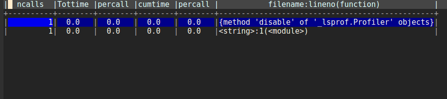

# py-prof

## Summary

Easily observe python cProfile output in Emacs via ctable.

## Why use py-prof?

  The minor mode *py-prof* was created to make the use of cProfile easier (and more interactive) for Emacs users.
	

## Usage

  *py-prof* provides just two commands:
  
  - `py-prof-run` (bound to `C-c r`) : asks for the function to be profiled (equal to using `cProfile.run("my_function()")`).
  - `py-prof-file` (bound to `C-c f`): asks for the name of the file to profile.
  
Once the chosen command is completed, a buffer containing the results of the profiler output (organized in a table) will be opened.
The table shown has the following properties:
  
  - a column can be sorted by clicking on its header,

  - hit `RET` on a row and `py-prof` will try to open the file the line is referring to (this feature is still *experimental*, it is not guaranteed to work always). 

*NB*: if there's not an inferior `python` process going on, instead of the table you'll get a warning message.
    

## Installing

Download `py-prof.el` somewhere on your machine then add that directory to Emacs load-path:

	(add-to-list 'load-path "~/path/to/py-prof/")
	(require 'py-prof)

Now you can activate the minor mode using:

	M-x py-prof-mode

## Contributing

Yes, please do! See [CONTRIBUTING][] for guidelines.

## License

See [COPYING][]. Copyright (c) 2017 boccigionata.

[CONTRIBUTING]: ./CONTRIBUTING.md
[COPYING]: ./COPYING
